# Implementation Plan - Autonomous Engineering Agent Orchestration Platform ("Carnot Cycle Circus")

## Goal Description
Build an **Autonomous Engineering Agent Orchestration Application** in **.NET 10 / C# 13** with an interactive **Blazor** frontend. The platform enables users to compose, configure, and orchestrate autonomous software engineering teams across 6 core roles:
1. **Technical Product Manager (TPM)**: Requirements deconstruction, user story mapping, acceptance criteria formulation, project timeline synthesis.
2. **Lead Architect**: System topology design, API contracts, domain boundaries, tech stack governance, architectural decision records (ADRs).
3. **Software Developer**: Feature implementation, algorithmic design, unit test writing, clean code standards.
4. **Security Engineer**: Threat modeling (STRIDE), static/dynamic analysis review, permission scoping, vulnerability audit, secret exposure checks.
5. **Optimization Engineer**: Performance profiling, latency/throughput bottlenecks, memory allocation audits, complexity analysis, benchmark design.
6. **Principal QA Analyst**: Test strategy formulation, edge-case analysis, regression testing, acceptance criteria validation, quality scorecards.

The platform provides:
- **Embedded Ticket Management & Work Decomposition Engine**: Hierarchical ticket system (Epics $\to$ Features/Bugs/Spikes $\to$ Subtasks), CLAW dependency scheduling, automated role/skill-based work splitting by the TPM and Lead Architect, structured inter-agent handoff packets, and an interactive Blazor Kanban / Ticket Studio.
- **Hierarchical Persistent Memory Layer (OpenViking / Mem0 Style)**: Multi-tier memory architecture (Working, Episodic, Semantic, Procedural) with embedded local vector/document storage, pluggable external memory connectors (OpenViking/Mem0/Qdrant REST endpoints), automated post-task memory consolidation, and a Blazor Memory Inspector & Pruner.
- **Agent Tool Execution Sandbox**: Executable tools (`web_search`, `csharp_syntax_check`, `test_runner`, `memory_lookup`, `adr_writer`).
- **Interactive UI Key Swapping & Key Vault**: Store and manage multiple named OpenRouter API keys in a client-side Key Vault, with one-click key swapping per agent or across the whole team, plus live mid-workflow key swapping directly from the execution dashboard.
- **Per-Agent OpenRouter API Keys & Role-Specific Model Selection**: Dedicated OpenRouter API key configuration per agent role (with team-level fallback inheritance), allowing each role to leverage the ideal model (e.g. `anthropic/claude-3.7-sonnet` for Lead Architect, `deepseek/deepseek-r1` or `openai/o3-mini` for Security & QA, `qwen/qwen-2.5-coder-32b-instruct` for Dev, `openai/gpt-4o` for TPM), along with per-agent token/cost telemetry.
- **Architectural Decision Records (ADRs) & Documentation Hub**: Automated ADR generation (Nygard/MADR format, lifecycle status, options matrix, trade-offs) and a unified Project Documentation Hub (C4 architecture diagrams, API specs, STRIDE threat models, performance budgets, QA test plans, Markdown bundle export).
- **Engineering Standards & Ticket Requirements Engine**: Configurable policies for **Feature**, **Bug**, and **Research/Spike** tickets with enforceable acceptance criteria, root cause analysis (RCA) requirements, and quality gates.
- **Efficient AI Knowledge Maps**: Compact, context-efficient knowledge graphs mapping domain concepts, architectural patterns, coding conventions, security rules, and learned insights with semantic sub-graph retrieval and interactive visual graph exploration.
- **Team Definition Management**: Save/load/export team manifests with pre-configured archetypes.
- **Dynamic Skill Importing & Matrix**: Web URLs, raw `SKILL.md`/YAML/JSON, and interactive matrix assignments.
- **Drag-and-Drop Workflow Canvas with Failure Ports**: Visual graph editor with 🟢 Input, 🔵 Success Output, 🔴 Failure/Reject ports, circuit breakers, and animated execution pulses.

---

## User Review Required

> [!IMPORTANT]
> **Embedded Ticket Management System**:
> - **Hierarchical Breakdown**: Epics $\to$ User Stories/Features/Bugs $\to$ Executable Subtasks.
> - **Automated Work Splitting**: TPM and Lead Architect automatically deconstruct project objectives into granular subtasks with explicit dependencies (`DependsOn`).
> - **Structured Inter-Agent Handoffs**: Work passes between agents via formal `HandoffPacket` payloads containing deliverables, context summaries, review criteria, and failure remediation instructions.
> - **Interactive Ticket Studio in Blazor**: Interactive Kanban board, backlog manager, ticket dependency CLAW visualizer, and manual ticket creation/assignment controls.

---

## System Architecture

```mermaid
flowchart TB
    subgraph Frontend ["Blazor UI (CarnotCycleCircus.Web)"]
        TF["Team Definition Studio"]
        TicketUI["Ticket Management Studio<br/>(Backlog, Kanban, Dependency CLAW, Handoff Logs)"]
        KeyVaultUI["Key Vault & Quick-Swap Bar"]
        MemoryUI["Memory Inspector & Pruner"]
        DocsUI["Docs & ADR Hub"]
        StandardsUI["Standards & Ticket Policies"]
        KMapUI["AI Knowledge Map Explorer"]
        SI["Skill Importer & Matrix"]
        Canvas["Visual Drag-and-Drop Canvas<br/>(Input / Output / Failure Ports)"]
        LiveDash["Execution Dashboard & Session Replay"]
    end

    subgraph CoreEngine ["Orchestration Engine (CarnotCycleCircus.Core)"]
        TeamDefManager["Team Definition Manager"]
        KeyVaultService["API Key Vault & Credential Manager"]
        
        subgraph TicketEngine ["Embedded Ticket & Work Routing Engine"]
            TicketStore["Ticket Store & State Machine"]
            WorkSplitter["TPM/Architect Work Decomposition Engine"]
            HandoffRouter["Inter-Agent Handoff & CLAW Scheduler"]
        end

        AdrManager["ADR & Documentation Engine"]
        StandardsEngine["Standards & Quality Gates Engine"]
        KMapEngine["AI Knowledge Map Engine"]
        SkillReg["Dynamic Skill Registry & skills/ Repository"]
        ToolSandbox["Agent Tool Sandbox"]
        
        subgraph MemorySystem ["Hierarchical Persistent Memory (OpenViking-Style)"]
            WorkingMem["Working Memory"]
            EpisodicMem["Episodic Memory"]
            SemanticMem["Semantic Memory"]
            ProceduralMem["Procedural Memory"]
            VectorStore["Embedded Vector Store"]
        end

        subgraph GraphOrchestrator ["Connectable Graph Orchestrator"]
            Graph["Workflow Graph Model"]
            Router["Input/Output & Failure Router"]
            CircuitBreaker["Circuit Breaker & Fallback Engine"]
        end

        subgraph OpenRouterLayer ["OpenRouter Inference Hub"]
            OR_Router["Dynamic Multi-Key Client Router"]
            SimFallback["Offline Scenario & Simulation Engine"]
        end

        StreamBus["Real-Time Channel Event Stream"]
    end

    TicketUI --> TicketEngine
    TF --> TeamDefManager
    KeyVaultUI --> KeyVaultService
    KeyVaultService --> OpenRouterLayer
    MemoryUI --> MemorySystem
    DocsUI --> AdrManager
    StandardsUI --> StandardsEngine
    KMapUI --> KMapEngine
    SI --> SkillReg
    Canvas --> Graph --> Router
    Router --> CircuitBreaker
    GraphOrchestrator --> TicketEngine
    GraphOrchestrator --> ToolSandbox
    GraphOrchestrator --> OpenRouterLayer
    GraphOrchestrator --> MemorySystem
    GraphOrchestrator --> AdrManager
    GraphOrchestrator --> StandardsEngine
    LiveDash <--> StreamBus
    LiveDash --> TicketUI
```



---

## Proposed Changes

### Phase 1: GitHub Open Source Best Practices, Build Skills Preservation & Split-Level Guidelines (First Step)

#### [NEW] Preserved Build Skills in Repository (`skills/`)
Preserve the exact engineering and architecture skills utilized to design, structure, and build this application:
1. `skills/engineering-multi-agent-systems-architect/SKILL.md`
2. `skills/project-structure/SKILL.md`
3. `skills/csharp-coding-standards/SKILL.md`
4. `skills/csharp-type-design-performance/SKILL.md`
5. `skills/csharp-concurrency-patterns/SKILL.md`
6. `skills/csharp-pro/SKILL.md`
7. `skills/skills-index-snippets/SKILL.md`
8. `skills/microsoft-extensions-dependency-injection/SKILL.md`
9. `skills/package-management/SKILL.md`
10. `skills/local-tools/SKILL.md`

#### [NEW] Root & Split-Level CLAUDE.md Files
- `CLAUDE.md` (Root): Compact executive index with solution build commands, architecture topology, ticket management summary, and subproject links.
- `src/CarnotCycleCircus.Core/CLAUDE.md`: Domain modeling, ticket state machine, handoff contracts, persistent memory patterns, OpenRouter client architecture, graph failure routing, and zero-allocation performance rules.
- `src/CarnotCycleCircus.Web/CLAUDE.md`: Blazor interactive components, Kanban drag-and-drop state, SignalR/event streaming, dark theme CSS standards.
- `tests/CarnotCycleCircus.Tests/CLAUDE.md`: Testing guidelines with xUnit, FluentAssertions, ticket lifecycle fixtures.

#### [NEW] .github/workflows/ci.yml, dependabot.yml, issue/PR templates, CODEOWNERS, CONTRIBUTING.md, CODE_OF_CONDUCT.md, SECURITY.md, .editorconfig, .gitattributes, .config/dotnet-tools.json, README.md.

---

### Phase 2: Solution & Central Build Configuration

#### [NEW] global.json, CarnotCycleCircus.slnx, Directory.Build.props, Directory.Packages.props, RELEASE_NOTES.md.

---

### Phase 3: Core Domain & Orchestrator (`src/CarnotCycleCircus.Core`)

#### [NEW] Embedded Ticket Management & Work Handoffs (`Domain/Tickets/`)
- `TicketItem.cs`: `Id`, `ParentEpicId`, `Title`, `Description`, `TicketType` (`Epic`, `Feature`, `Bug`, `ResearchSpike`, `Subtask`), `Status` (`Backlog`, `Ready`, `InProgress`, `Review`, `Remediating`, `Done`, `Blocked`), `AssigneeRole`, `CreatedByRole`, `Priority`, `DependsOnTicketIds`, `AcceptanceCriteria`, `CreatedAt`, `CompletedAt`.
- `HandoffPacket.cs`: `HandoffId`, `TicketId`, `FromAgentRole`, `ToAgentRole`, `Artifacts`, `ContextSummary`, `ActionRequested`, `ReviewChecklist`, `RemediationNotes`, `Timestamp`.
- `ITicketStore.cs` & `TicketStore.cs`: In-memory & persistent ticket ledger, state machine transitions, dependency validation, and search/filter.
- `WorkDecompositionEngine.cs`:
  - TPM splits incoming feature/epic requirements into user stories and acceptance criteria.
  - Lead Architect breaks user stories into technical subtasks (architecture ADR, implementation, threat modeling, performance profiling, QA verification) with CLAW dependencies.
- `HandoffRouter.cs`: Automatically routes next ready subtasks to assigned agent roles upon upstream completion, packaging context and deliverables.

#### [NEW] Agent Tool Execution Sandbox (`Domain/Tools/`)
- `IToolDefinition.cs`, `ToolExecutionContext.cs`, `ToolResult.cs`, `WebSearchTool.cs`, `CSharpSyntaxCheckTool.cs`, `TestRunnerTool.cs`, `MemoryLookupTool.cs`, `AdrWriterTool.cs`.

#### [NEW] Hierarchical Persistent Memory System (`Domain/Memory/`)
- `MemoryType.cs`, `MemoryEntry.cs`, `IPersistentMemoryStore.cs`, `EmbeddedVectorMemoryStore.cs`, `ExternalMemoryConnector.cs`, `MemoryConsolidationEngine.cs`, `ContextAwareMemoryInjector.cs`.

#### [NEW] API Key Vault & Dynamic Key Swapping (`Domain/Inference/`)
- `ApiKeyVaultEntry.cs`, `IApiKeyVaultService.cs`, `ApiKeyVaultService.cs`.

#### [NEW] OpenRouter Multi-Key Client & Offline Scenarios (`Domain/Inference/`)
- `OpenRouterConfig.cs`, `IOpenRouterClient.cs`, `OpenRouterClient.cs`, `AgentInferenceResolver.cs`, `SimulatedScenarioEngine.cs`.

#### [NEW] Agent Models & Personas (`Domain/Agents/`)
- `AgentRole.cs`, `AgentPersona.cs`, `AgentMember.cs`, `EngineeringTeam.cs`.

#### [NEW] ADR & Documentation Engine (`Domain/Docs/`)
- `ArchitecturalDecisionRecord.cs`, `ProjectDocument.cs`, `IAdrDocumentManager.cs`, `AdrDocumentManager.cs`.

#### [NEW] Standards & Ticket Requirements Engine (`Domain/Standards/`)
- `EngineeringStandardsProfile.cs`, `IStandardsValidator.cs`, `StandardsValidator.cs`.

#### [NEW] AI Knowledge Map Engine (`Domain/Knowledge/`)
- `KnowledgeNode.cs`, `KnowledgeEdge.cs`, `KnowledgeMap.cs`, `IKnowledgeMapService.cs`, `KnowledgeMapService.cs`.

#### [NEW] Team Definitions & Archetypes (`Domain/Teams/`)
- `TeamDefinition.cs`, `TeamDefinitionManager.cs`, `TeamArchetypes.cs`.

#### [NEW] Skill & Tool Management & Importer (`Domain/Skills/`)
- `SkillDefinition.cs`, `ISkillImporter.cs`, `SkillImporter.cs`, `SkillRegistry.cs`.

#### [NEW] Connectable Graph Engine & Failure Routing (`Domain/Graph/`)
- `WorkflowGraph.cs`, `GraphNode.cs`, `PortConnection.cs`, `FailurePolicy.cs`, `GraphWorkflowExecutor.cs`.

#### [NEW] Real-Time Messaging & Telemetry (`Domain/Events/`)
- `AgentEventStream.cs`, `AgentMessage.cs`, `ArtifactItem.cs`.

---

### Phase 4: Blazor Frontend (`src/CarnotCycleCircus.Web`)

#### [NEW] Layout & Navigation (`Shared/`, `Components/`)
- `MainLayout.razor`, `NavMenu.razor`: Modern dark theme with navigation to Team Definition, Ticket Studio, Workflow Canvas, Execution Dashboard, Memory Inspector, Docs & ADRs, Standards, and Skills.

#### [NEW] Embedded Ticket Studio (`Pages/TicketManager.razor`, `Components/TicketCard.razor`, `Components/TicketModal.razor`)
- **Interactive Kanban Board**: Swimlanes for Backlog, Ready, In Progress, Review, Remediation, and Done.
- **Decomposition Tree & CLAW View**: Visual representation of Epics $\to$ Subtasks and dependency flow.
- **Handoff History Drawer**: Chronological log of work handoffs between agents with attached deliverables and review notes.
- **Manual Ticket Actions**: Create tickets, edit acceptance criteria, manually assign/reassign to agent roles, or change status.

#### [NEW] Memory Inspector & Pruner (`Pages/MemoryInspector.razor`)
- Memory search, role/type filters, importance editor, and pruning.

#### [NEW] Key Vault & Key Swapper Modal (`Components/KeyVaultModal.razor`)
- Named OpenRouter keys, test connections, batch-swap across agents.

#### [NEW] Team Definition Studio (`Pages/TeamDefinition.razor`)
- Roster cards, model badges, API key dropdowns, test connection, archetypes.

#### [NEW] ADRs & Documentation Hub (`Pages/DocsAndAdrs.razor`)
- ADR Explorer & Editor, C4 Architecture views, API specs, STRIDE Threat Models, QA Traceability matrix, and Markdown export.

#### [NEW] Engineering Standards Studio (`Pages/StandardsManager.razor`)
- Standards editor for Feature, Bug, and Research tickets.

#### [NEW] AI Knowledge Map Explorer (`Pages/KnowledgeMapExplorer.razor`)
- Interactive visual knowledge graph with node editor.

#### [NEW] Skill Importer & Matrix (`Pages/SkillManager.razor`, `Pages/SkillMatrix.razor`)
- Web URL import, raw editor, file upload, and capability matrix.

#### [NEW] Drag-and-Drop Workflow Canvas (`Pages/WorkflowCanvas.razor`)
- Visual node canvas with drag-and-drop role blocks, input/output/failure ports.

#### [NEW] Real-Time Execution Dashboard (`Pages/ExecutionDashboard.razor`)
- Live graph animator with active execution pulses, live key swapper, real-time agent chat stream, tool logs, live Kanban sync, and session report export.

---

### Phase 5: Test Suite (`tests/CarnotCycleCircus.Tests`)

#### [NEW] Unit & Integration Tests
- `TicketStoreTests.cs`: Ticket CRUD, state transitions, dependency ordering, and validation.
- `WorkDecompositionTests.cs`: TPM & Architect task decomposition, subtask generation, and role assignment.
- `HandoffRouterTests.cs`: Inter-agent handoff packet generation, CLAW progression, and failure loop routing.
- `ToolSandboxTests.cs`: WebSearch, CSharpSyntaxCheck, TestRunner, and MemoryLookup execution.
- `PersistentMemoryTests.cs`: Memory storage, cosine similarity vector search, consolidation, and pruning.
- `ApiKeyVaultTests.cs`: Key swapping, team assignment, rate-limit fallback.
- `OpenRouterClientTests.cs`: Multi-key authorization, model routing, response parsing.
- `AdrDocumentManagerTests.cs`: ADR lifecycle transitions, validation, and export.
- `StandardsValidatorTests.cs`: Ticket compliance against standards.
- `KnowledgeMapTests.cs`: Graph construction, context-efficient sub-graph queries.
- `SkillImporterTests.cs`: Web URL fetch, SKILL.md parsing, YAML/JSON parsing.
- `WorkflowGraphTests.cs`: Success routing, failure routing, circuit breaker trips.
- `EventStreamTests.cs`: Real-time message streaming.

---

## Verification Plan

### Automated Tests
```bash
# Build the complete solution
dotnet build CarnotCycleCircus.slnx

# Run all unit and integration test suites
dotnet test CarnotCycleCircus.slnx --logger "console;verbosity=detailed"
```

### Manual Verification
1. **GitHub Standards, Preserved Skills & Split-Level Docs**:
   - Verify `.github/`, `skills/`, root and project-level `CLAUDE.md` files.
2. **Launch the Blazor Web App**:
   ```bash
   dotnet run --project src/CarnotCycleCircus.Web
   ```
3. **Embedded Ticket Management & Work Splitting**:
   - In **Ticket Studio**, create or view an Epic (e.g. "Build DistributedPubSub"); watch the TPM & Architect automatically deconstruct it into technical subtasks.
   - Trace how work is passed between agents via **Handoff Packets** (TPM $\to$ Architect $\to$ Dev $\to$ Security/Optimizer $\to$ QA).
4. **Failure Loop & Ticket Remediation**:
   - Observe QA or Security failing a subtask; verify the ticket moves to `Remediation` and routes back to the Developer node via the red failure cable with failure notes.
5. **Memory, Key Vault, and Workflow Execution**:
   - Test key swapping, memory consolidation, and report bundle export.
