# Carnot Cycle Circus 🎪⚡

[](https://github.com/chadahoochie/carnot-cycle-circus/actions/workflows/ci.yml)
[](LICENSE)
[](https://dotnet.microsoft.com/)

**Carnot Cycle Circus** is a high-efficiency Autonomous Engineering Agent Orchestration Platform built in **.NET 10 / C# 13** with an interactive **Blazor** frontend. It enables software teams to compose, configure, and orchestrate specialized AI engineering roles across complete software lifecycles.

---

## 🌟 Key Features

1. **6 Core Autonomous Engineering Roles**:
   - 🎯 **Technical Product Manager (TPM)**: Requirements deconstruction, user story mapping, acceptance criteria formulation.
   - 🏛️ **Lead Architect**: System topology design, API contracts, domain boundaries, Architectural Decision Records (ADRs).
   - 💻 **Software Developer**: Feature implementation, algorithmic design, unit test authoring, clean code standards.
   - 🛡️ **Security Engineer**: Threat modeling (STRIDE), static/dynamic analysis review, secret exposure checks.
   - ⚡ **Optimization Engineer**: Performance profiling, latency/throughput bottleneck analysis, allocation audits.
   - 🧪 **Principal QA Analyst**: Test strategy formulation, edge-case testing, acceptance criteria validation, quality scorecards.

2. **Embedded Ticket Management & Work Decomposition Engine**:
   - Hierarchical breakdown: Epics $\to$ Stories/Features/Bugs/Spikes $\to$ Granular Subtasks.
   - Automated TPM & Lead Architect work decomposition with DAG dependency scheduling.
   - Formal inter-agent `HandoffPacket` payloads passing deliverables, context, review checklists, and remediation notes.
   - Interactive Blazor Kanban board and Dependency DAG visualizer.

3. **Hierarchical Persistent Memory Layer (OpenViking-Style)**:
   - Multi-tier memory architecture: Working, Episodic, Semantic, and Procedural memory.
   - Embedded cosine-similarity vector store with automated post-task consolidation and interactive memory pruning.

4. **Connectable Visual Workflow Canvas with Failure Ports**:
   - Visual node canvas with 🟢 Input, 🔵 Success Output, and 🔴 Failure/Reject ports.
   - Automatic failure loopbacks for QA/Security rejection and automated circuit breaker protections.

5. **API Key Vault & Dynamic Swapping**:
   - Client-side named OpenRouter key storage.
   - Per-agent role key mapping or team-wide fallback inheritance.
   - Live mid-flight key swapping directly from the execution dashboard.

6. **Documentation & ADR Hub**:
   - Automated ADR authoring (Nygard/MADR formats) and unified documentation suite (C4 diagrams, API specs, STRIDE models, bundle export).

7. **Engineering Standards & Ticket Policies**:
   - Configurable acceptance criteria and quality gates for Features, Bugs, and Spikes.

8. **AI Knowledge Maps**:
   - Compact, context-efficient knowledge graphs mapping domain concepts, architectural patterns, and security rules with semantic sub-graph queries.

---

## 🏗️ Solution Architecture

```mermaid
flowchart TB
    subgraph Frontend ["Blazor UI (CarnotCycleCircus.Web)"]
        TF["Team Definition Studio"]
        TicketUI["Ticket Management Studio<br/>(Backlog, Kanban, Dependency DAG, Handoff Logs)"]
        KeyVaultUI["Key Vault & Quick-Swap Bar"]
        MemoryUI["Memory Inspector & Pruner"]
        DocsUI["Docs & ADR Hub"]
        StandardsUI["Standards & Ticket Policies"]
        KMapUI["AI Knowledge Map Explorer"]
        SI["Skill Importer & Matrix"]
        Canvas["Visual Drag-and-Drop Canvas<br/>(Input / Output / Failure Ports)"]
        LiveDash["Execution Dashboard & Session Replay"]
    end

    subgraph CoreEngine ["Orchestration Engine (CarnotCycleCircus.Core)"]
        TeamDefManager["Team Definition Manager"]
        KeyVaultService["API Key Vault & Credential Manager"]
        
        subgraph TicketEngine ["Embedded Ticket & Work Routing Engine"]
            TicketStore["Ticket Store & State Machine"]
            WorkSplitter["TPM/Architect Work Decomposition Engine"]
            HandoffRouter["Inter-Agent Handoff & DAG Scheduler"]
        end

        AdrManager["ADR & Documentation Engine"]
        StandardsEngine["Standards & Quality Gates Engine"]
        KMapEngine["AI Knowledge Map Engine"]
        SkillReg["Dynamic Skill Registry & skills/ Repository"]
        ToolSandbox["Agent Tool Sandbox"]
        
        subgraph MemorySystem ["Hierarchical Persistent Memory (OpenViking-Style)"]
            WorkingMem["Working Memory"]
            EpisodicMem["Episodic Memory"]
            SemanticMem["Semantic Memory"]
            ProceduralMem["Procedural Memory"]
            VectorStore["Embedded Vector Store"]
        end

        subgraph GraphOrchestrator ["Connectable Graph Orchestrator"]
            Graph["Workflow Graph Model"]
            Router["Input/Output & Failure Router"]
            CircuitBreaker["Circuit Breaker & Fallback Engine"]
        end

        subgraph OpenRouterLayer ["OpenRouter Inference Hub"]
            OR_Router["Dynamic Multi-Key Client Router"]
            SimFallback["Offline Scenario & Simulation Engine"]
        end

        StreamBus["Real-Time Channel Event Stream"]
    end

    TicketUI --> TicketEngine
    TF --> TeamDefManager
    KeyVaultUI --> KeyVaultService
    KeyVaultService --> OpenRouterLayer
    MemoryUI --> MemorySystem
    DocsUI --> AdrManager
    StandardsUI --> StandardsEngine
    KMapUI --> KMapEngine
    SI --> SkillReg
    Canvas --> Graph --> Router
    Router --> CircuitBreaker
    GraphOrchestrator --> TicketEngine
    GraphOrchestrator --> ToolSandbox
    GraphOrchestrator --> OpenRouterLayer
    GraphOrchestrator --> MemorySystem
    GraphOrchestrator --> AdrManager
    GraphOrchestrator --> StandardsEngine
    LiveDash <--> StreamBus
    LiveDash --> TicketUI
```



---

## 🚀 Getting Started

### Prerequisites
- [.NET 10 SDK](https://dotnet.microsoft.com/) (`10.0.300+`)

### Building & Running

```bash
# Clone repository
git clone https://github.com/chadahoochie/carnot-cycle-circus.git
cd carnot-cycle-circus

# Build solution
dotnet build CarnotCycleCircus.slnx

# Run automated tests
dotnet test CarnotCycleCircus.slnx

# Launch Blazor Web Application
dotnet run --project src/CarnotCycleCircus.Web
```

Open `http://localhost:5000` (or the console URL) in your browser.

---

## 📚 Preserved Engineering Skills

This repository preserves the exact architecture and engineering skills used to design and build it under `skills/`:
- `skills/engineering-multi-agent-systems-architect/`
- `skills/project-structure/`
- `skills/csharp-coding-standards/`
- `skills/csharp-type-design-performance/`
- `skills/csharp-concurrency-patterns/`
- `skills/csharp-pro/`
- `skills/skills-index-snippets/`
- `skills/microsoft-extensions-dependency-injection/`
- `skills/package-management/`
- `skills/local-tools/`

---

## 📄 License
Distributed under the [MIT License](LICENSE).
