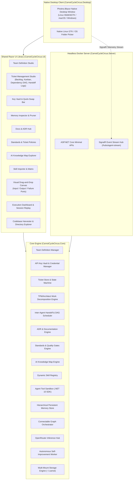

# Carnot Cycle Circus 🎪⚡

[](https://github.com/chadahoochie/carnot-cycle-circus/actions/workflows/ci.yml)
[](LICENSE)
[](https://dotnet.microsoft.com/)

> *"Operating at theoretical maximum Carnot thermodynamic efficiency to orchestrate the chaotic 6-ring circus of autonomous engineering agents."*
>
> 🎪 **The Squad**: TPM invents fantasy deadlines $\to$ Architect draws cathedral abstractions $\to$ Developer brews caffeine into code $\to$ Security panics over everything $\to$ Optimizer micro-benchmarks nanoseconds $\to$ QA gleefully obliterates developer confidence.

**Carnot Cycle Circus** is a high-efficiency Autonomous Engineering Agent Orchestration Platform built in **.NET 10 / C# 13** with an interactive **Blazor** frontend. It enables software teams to compose, configure, and orchestrate specialized AI engineering roles across complete software lifecycles without violating the laws of thermodynamics (or failing quality gates).

---

## 🗺️ Documentation Suite & System Map

A comprehensive documentation suite is maintained under [`docs/`](docs/README.md) for both human engineers and LLMs / autonomous coding agents:

- 📖 **[Documentation Portal](docs/README.md)**: Central entry point and navigation map.
- 🤖 **[LLMS.txt Spec](docs/LLMS.txt)**: High-density machine-readable system specification for agent context ingestion.
- 🏛️ **Architecture & Topologies**:
  - [System Overview & C4 Models](docs/architecture/system-overview.md)
  - [Agent Orchestration & Failure Ports](docs/architecture/agent-orchestration.md)
  - [Embedded Ticket System & DAG Decomposition](docs/architecture/ticket-system.md)
  - [Hierarchical Persistent Memory (OpenViking-Style)](docs/architecture/memory-system.md)
  - [Inference Hub, Key Vault & Security](docs/architecture/inference-and-security.md)
  - [AI Knowledge Maps & Skill Registry](docs/architecture/knowledge-and-skills.md)
- 📜 **Engineering Standards & Policies**:
  - [C# 13 & .NET 10 Coding Standards](docs/standards/coding-standards.md)
  - [Quality Gates & Ticket Policies](docs/standards/quality-gates.md)
  - [Documentation & ADR Standards](docs/standards/documentation-standards.md)
- 📋 **[Architectural Decision Records (ADRs)](docs/adrs/README.md)**: Complete catalog of formal architectural decisions (ADR-0001 through ADR-0007).
- 🧭 **Developer Guides**:
  - [Developer Onboarding Guide](docs/guides/developer-onboarding.md)
  - [Extending the Platform](docs/guides/extending-the-platform.md)
  - [LLM & Agent Interaction Guide](docs/guides/llm-agent-guide.md)
  - [Testing Guide & QA](docs/guides/testing-guide.md)
- 🔍 **Technical References**:
  - [Core Domain Reference](docs/api/core-domain-reference.md)
  - [Web Components Reference](docs/api/web-components-reference.md)

---

## 🌟 Key Features

1. **6 Core Autonomous Engineering Roles**:
   - 🎯 **Technical Product Manager (TPM)**: Requirements deconstruction, user story mapping, acceptance criteria formulation.
   - 🏛️ **Lead Architect**: System topology design, API contracts, domain boundaries, Architectural Decision Records (ADRs).
   - 💻 **Software Developer**: Feature implementation, algorithmic design, unit test authoring, clean code standards.
   - 🛡️ **Security Engineer**: Threat modeling (STRIDE), static/dynamic analysis review, secret exposure checks.
   - ⚡ **Optimization Engineer**: Performance profiling, latency/throughput bottleneck analysis, allocation audits.
   - 🧪 **Principal QA Analyst**: Test strategy formulation, edge-case testing, acceptance criteria validation, quality scorecards.

2. **Embedded Ticket Management & Work Decomposition Engine**:
   - Hierarchical breakdown: Epics $\to$ Stories/Features/Bugs/Spikes $\to$ Granular Subtasks.
   - Automated TPM & Lead Architect work decomposition with DAG dependency scheduling.
   - Formal inter-agent `HandoffPacket` payloads passing deliverables, context, review checklists, and remediation notes.
   - Interactive Blazor Kanban board and Dependency DAG visualizer.

3. **Hierarchical Persistent Memory Layer (OpenViking-Style)**:
   - Multi-tier memory architecture: Working, Episodic, Semantic, and Procedural memory.
   - Embedded cosine-similarity vector store with automated post-task consolidation and interactive memory pruning.

4. **Connectable Visual Workflow Canvas with Failure Ports**:
   - Visual node canvas with 🟢 Input, 🔵 Success Output, and 🔴 Failure/Reject ports.
   - Automatic failure loopbacks for QA/Security rejection and automated circuit breaker protections.

5. **API Key Vault & Dynamic Swapping**:
   - Client-side named OpenRouter key storage.
   - Per-agent role key mapping or team-wide fallback inheritance.
   - Live mid-flight key swapping directly from the execution dashboard.

6. **Documentation & ADR Hub**:
   - Automated ADR authoring (Nygard/MADR formats) and unified documentation suite (C4 diagrams, API specs, STRIDE models, bundle export).

7. **Engineering Standards & Ticket Policies**:
   - Configurable acceptance criteria and quality gates for Features, Bugs, and Spikes.

8. **AI Knowledge Maps**:
   - Compact, context-efficient knowledge graphs mapping domain concepts, architectural patterns, and security rules with semantic sub-graph queries.

---

## 🏗️ Solution Architecture & Multi-Host Decoupled Model



---

## 🚀 Getting Started

### Prerequisites
- [.NET 10 SDK](https://dotnet.microsoft.com/) (`10.0.300+`)
- On Linux Desktop: `libwebkit2gtk-4.1` (or `4.0`) for Photino native window rendering.

### Running Options

#### 1. 🖥️ Native Desktop Application (Recommended for Linux / macOS / Windows)
Runs as a native, lightweight (~40MB RAM) desktop application with native OS folder browsing dialogs:
```bash
# Run from source:
dotnet run --project src/CarnotCycleCircus.Desktop

# Or install locally into ~/.carnot/bin:
./scripts/install-local.sh
~/.carnot/bin/carnot-desktop
```

#### 2. 🐳 Headless Agent Server in Docker (Multi-Mount Storage)
Run only the headless agent engine inside a container with persistent storage and host workspace mounts:
```bash
# Launch Docker container with volume mounts:
docker compose up -d

# Check health endpoint:
curl http://localhost:5000/health
```

**Docker Volume Mounts**:
- `~/.carnot/data` $\to$ `/carnot/data`: Persistent server state (encrypted vault, vector memories, tickets, custom skills).
- `~/.carnot/artifacts` $\to$ `/carnot/artifacts`: Generated deliverables (ADRs, code snippets, STRIDE threat models, QA scorecards).
- `./workspace` $\to$ `/workspace`: Target host repository for codebase scanning, syntax checks, and testing.

#### 3. 🌐 Interactive Web Application
```bash
dotnet run --project src/CarnotCycleCircus.Web
```
Open `http://localhost:5000` in your browser.

# Follow live logs
./scripts/docker-run.sh logs
```

#### Persistent Volumes Overview
- `carnot_data`: Stores JSON databases (`memories.json`, `tickets.json`, `handoffs.json`, `knowledgemap.json`, `skills.json`, `teams.json`, `adrs.json`, `keys.json`).
- `carnot_artifacts`: Stores exported ADR markdown bundles, PRDs, and generated artifacts.
- `carnot_skills`: Stores imported YAML/Markdown skill definitions.
- `carnot_redis`: Distributed caching and high-speed memory connector.

#### 🌱 Continuous Autonomous Self-Improvement
The stack runs a background distillation engine (`AutonomousSelfImprovementWorker`) that periodically (and after every workflow completion) analyzes failure remediations and execution metrics, extracting new defensive rules and procedural recipes to improve system accuracy and velocity over time. View the live manifest and learning metrics at `http://localhost:5000/persistence`.

---

## 📚 Preserved Engineering Skills

This repository preserves the exact architecture and engineering skills used to design and build it under `skills/`:
- `skills/engineering-multi-agent-systems-architect/`
- `skills/project-structure/`
- `skills/csharp-coding-standards/`
- `skills/csharp-type-design-performance/`
- `skills/csharp-concurrency-patterns/`
- `skills/csharp-pro/`
- `skills/skills-index-snippets/`
- `skills/microsoft-extensions-dependency-injection/`
- `skills/package-management/`
- `skills/local-tools/`

---

## 📄 License
Distributed under the [MIT License](LICENSE).
