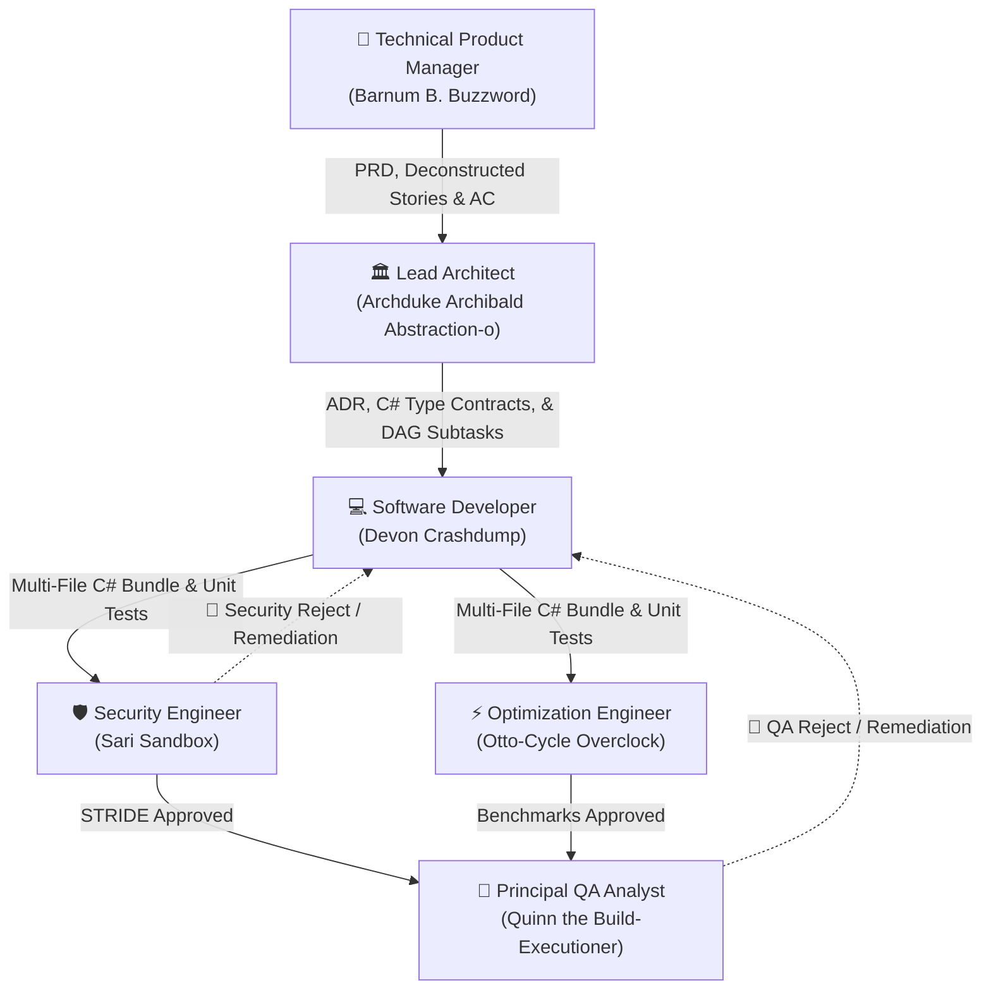

# Agent Orchestration & Execution Engine 🤖🎪

## 1. Overview

The Carnot Cycle Circus Agent Orchestration Engine models an autonomous software engineering organization composed of **six specialized roles**. Agents collaborate via a connectable **Directed Acyclic Graph (DAG)** with explicit **Input (🟢)**, **Success Output (🔵)**, and **Failure / Remediation (🔴)** ports.

---

## 2. The 6 Core Autonomous Roles

Each agent role represents a specialized engineering discipline with distinct persona traits, default models, temperature settings, and tool access permissions.



### 2.1 Role Specifications Matrix

| Role (`AgentRole`) | Persona Name | Default OpenRouter Model | Temp | Allowed Tools | Primary Technical Output |
| :--- | :--- | :--- | :--- | :--- | :--- |
| **Technical Product Manager** | **Barnum B. Buzzword** | `openai/gpt-4o` | `0.2` | `web_search`, `memory_lookup` | Product Requirements Documents (PRDs), Epics, User Stories, Acceptance Criteria |
| **Lead Architect** | **Archduke Archibald Abstraction-o** | `anthropic/claude-3.7-sonnet` | `0.1` | `web_search`, `csharp_syntax_check`, `memory_lookup`, `adr_writer` | Architectural Decision Records (ADRs with exact C# Type Contracts), C4 Diagrams, Domain Boundaries, Technical Subtasks |
| **Software Developer** | **Devon "Coldbrew" Crashdump** | `qwen/qwen-2.5-coder-32b-instruct` | `0.1` | `csharp_syntax_check`, `test_runner`, `memory_lookup` | Modular C# 13 Multi-File Bundles (Interfaces, Services, DI Extensions, xUnit Tests), Self-Healing Syntax Validation |
| **Security Engineer** | **Sari "Tinfoil" Sandbox** | `openai/o3-mini` | `0.0` | `web_search`, `csharp_syntax_check`, `memory_lookup` | STRIDE Threat Models against actual source code, Vulnerability Assessments, Permission Scopes, Secret Audits |
| **Optimization Engineer** | **Otto-Cycle Overclock** | `anthropic/claude-3.7-sonnet` | `0.0` | `csharp_syntax_check`, `test_runner`, `memory_lookup` | BenchmarkDotNet Reports against delivered methods, Latency Profiles (<5ms P99), Zero Gen0 Allocation Audits |
| **Principal QA Analyst** | **Quinn the Build-Executioner** | `deepseek/deepseek-r1` | `0.1` | `test_runner`, `memory_lookup`, `csharp_syntax_check` | QA Test Plans, Traceability Matrices mapped to unit tests, Quality Scorecards, Production Certification |

---

## 3. The Deliverable Isolation Contract (ADR-0005)

A defining architectural feature of Carnot Cycle Circus is the **Deliverable Isolation Contract**:

> **Contract Rule**:
> Agents exhibit expressive, witty, and cynical personalities in their conversational thought logs, chat messages, and informal banter, **BUT** all formal technical deliverables (PRDs, ADRs, C# Code, Threat Models, Benchmarks, and QA Scorecards) **MUST remain 100% professional, rigorous, unambiguous, and completely free of joke text or sarcastic phrasing.**

### Concrete Isolation Example

#### Conversational Log (Allowed Banter)
```json
{
  "sender": "Barnum B. Buzzword (TPM)",
  "content": "🎯 Transformed our vague management hopes into 5 heavily bureaucratic stories with non-negotiable acceptance criteria. You're welcome!"
}
```

#### Deliverable Artifact (Strictly Professional)
```markdown
# Product Requirements Document (PRD): User Authentication Service
## 1. Executive Summary & Objective
Implement OAuth2 / OpenID Connect authorization code flow with PKCE token rotation.

## 2. Functional Acceptance Criteria
- [ ] Conforms to RFC 7636 (PKCE).
- [ ] Token refresh operations complete within < 10ms.
- [ ] Zero secret exposure in client-side telemetry.
```

---

## 4. Connectable Workflow Graph with Failure Ports

The execution engine is modeled as a visual node graph (`WorkflowGraph`):

```csharp
public record GraphNode(
    string Id,
    AgentRole Role,
    string Name,
    int X,
    int Y,
    NodeExecutionState State = NodeExecutionState.Idle,
    int RetryCount = 0,
    string? CurrentTicketId = null,
    string? LastOutputSummary = null
);

public record PortConnection(
    string SourceNodeId,
    PortType SourcePort,
    string TargetNodeId,
    PortType TargetPort
);

public enum PortType
{
    Input,    // 🟢 Green Port: Receives incoming handoffs
    Output,   // 🔵 Blue Port: Emits successful deliverables
    Failure   // 🔴 Red Port: Emits rejection & remediation packets
}
```

### 4.1 Failure Ports & Remediation Loopbacks

Standard linear agent pipelines abort completely when a downstream agent rejects a deliverable. Carnot Cycle Circus introduces **dedicated Failure Ports (🔴)**:

1. When **Security Engineer** or **Principal QA Analyst** detects a defect or policy violation, the node trips its Failure Port.
2. The `HandoffRouter` generates a `HandoffPacket` containing `remediationNotes` and rejection findings.
3. The ticket transitions to `TicketStatus.Remediating` and is routed back to the **Software Developer** node.
4. The Developer node transitions to `NodeExecutionState.Remediating`, updates the artifact, and returns the fix.
5. The review node re-evaluates the deliverable without restarting the entire pipeline from scratch.

### 4.2 Circuit Breakers

To prevent infinite loops when agents disagree indefinitely, the `FailurePolicy` enforces circuit breaking:

```csharp
public record FailurePolicy(
    int MaxRetries = 3,
    bool CircuitBreakerEnabled = true,
    AgentRole FallbackRole = AgentRole.SoftwareDeveloper
);
```

If `RetryCount` exceeds `MaxRetries`, the node halts, trips an `Alert` event on `IAgentEventStream`, and awaits human operator intervention.

---

## 5. Team Archetypes

The `TeamDefinitionManager` ships with six pre-configured team archetypes:

1. **🎪 The Full 6-Ring Circus (Balanced)**: The standard full-spectrum squad. Balanced temperatures and role-specialized models (`GPT-4o`, `Claude 3.7 Sonnet`, `Qwen 2.5 Coder`, `o3-mini`, `DeepSeek-R1`).
2. **🤠 Move Fast & Break Production (Cowboy Mode)**: Fast, high-temperature configuration (`temp=0.7`) with QA and Security disabled. Deploys straight to production.
3. **🏛️ Ivory Tower Cathedral Builders (Enterprise Edition)**: Ultra-low temperature (`temp=0.05`) with `Claude 3.7 Sonnet` on all roles. Maximum formal documentation, ADRs, and layers of abstraction.
4. **🛡️ Paranoid Zero-Trust Bunker (Security Hardened)**: Pure zero-trust configuration powered by `openai/o3-mini` and `deepseek/deepseek-r1` with `temp=0.0`. Extreme STRIDE paranoia and boundary checks.
5. **⚡ Zero-Allocation Zealots (Nano-Benchmarkers)**: High-performance configuration enforcing ValueTask pipelines, Span slicing, and 0 Gen0 GC allocations.
6. **🧪 Chaos Monkey Rodeo (QA Dictatorship)**: Totalitarian QA configuration where Quinn executes exhaustive negative edge-cases, null inputs, and fuzzing payloads.
