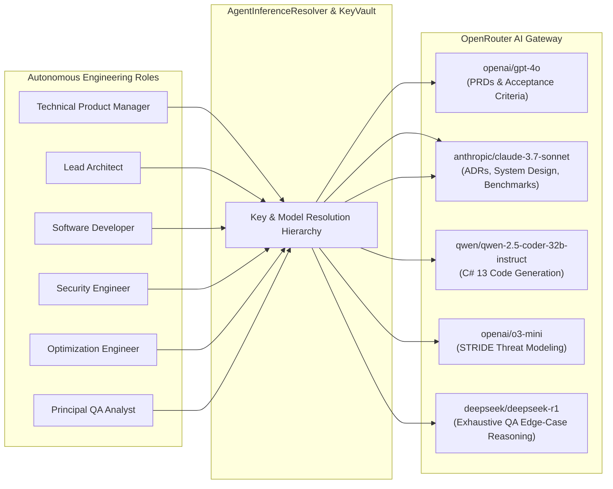

# Inference Hub, Key Vault & Security Architecture ⚡🛡️

## 1. Overview

Carnot Cycle Circus features a flexible **Inference Hub & API Key Vault** (`CarnotCycleCircus.Core.Domain.Inference`). It enables software teams to route different autonomous engineering roles to their optimal LLM models via **OpenRouter**, manage multiple API credentials safely with live mid-flight swapping, and seamlessly fallback to an offline deterministic simulation engine for testing and air-gapped development.

---

## 2. Multi-Model Inference Routing

Different engineering roles have vastly different reasoning, coding, and cost requirements. Carnot Cycle Circus avoids one-size-fits-all model routing:



### 2.1 Model Mapping Defaults

| Role | Default Model | Fallback Model | Default Temp | Justification |
| :--- | :--- | :--- | :--- | :--- |
| **TPM** | `openai/gpt-4o` | `anthropic/claude-3.5-haiku` | `0.2` | Broad business logic, PRD formatting, user story clarity. |
| **Lead Architect** | `anthropic/claude-3.7-sonnet` | `openai/gpt-4o` | `0.1` | Extended reasoning, clean architectural abstractions, MADR structure. |
| **Software Developer** | `qwen/qwen-2.5-coder-32b-instruct` | `anthropic/claude-3.7-sonnet` | `0.1` | Specialized coding syntax, C# 13 features, low latency. |
| **Security Engineer** | `openai/o3-mini` | `deepseek/deepseek-r1` | `0.0` | Deep deterministic reasoning for STRIDE threat models and vulnerability detection. |
| **Optimization Engineer** | `anthropic/claude-3.7-sonnet` | `openai/gpt-4o` | `0.0` | Algorithmic analysis, asymptotic complexity, ValueTask / Span memory auditing. |
| **Principal QA Analyst** | `deepseek/deepseek-r1` | `openai/o3-mini` | `0.1` | Adversarial reasoning, demonic edge cases, fuzzing matrices. |

---

## 3. Client-Side API Key Vault (`ApiKeyVaultService`)

To safeguard sensitive API credentials:
1. **Isolated Key Storage**: Keys are held in memory during operation and never written to plain server logs.
2. **Masked Representations**: All UI views display masked key strings (e.g. `sk-or...4f9a`).
3. **Live Mid-Flight Swapping**: Operators can switch the active API key directly from the top navigation bar or Key Vault modal without restarting running workflows.
4. **Key Connectivity Testing**: Built-in endpoint validation tests key validity against `https://openrouter.ai/api/v1/auth/key`.

### 3.1 Key Resolution Hierarchy (`AgentInferenceResolver`)

When an agent executes an inference task, credentials are resolved in priority order:

$$\text{Role Custom Key} \to \text{Team Global Key} \to \text{Active Vault Key} \to \text{Default Sandbox Key}$$

```csharp
public (string Model, string ApiKey) ResolveInferenceParameters(AgentMember member, EngineeringTeam team)
{
    var model = member.EffectiveModel;
    
    string? apiKey = null;
    if (!string.IsNullOrEmpty(member.CustomApiKeyId))
    {
        apiKey = _keyVault.GetKey(member.CustomApiKeyId)?.RawApiKey;
    }

    if (string.IsNullOrEmpty(apiKey) && !string.IsNullOrEmpty(team.ActiveGlobalApiKeyId))
    {
        apiKey = _keyVault.GetKey(team.ActiveGlobalApiKeyId)?.RawApiKey;
    }

    if (string.IsNullOrEmpty(apiKey))
    {
        apiKey = _keyVault.GetActiveKey()?.RawApiKey ?? "sk-or-v1-sandbox-mock-carnot-circus-0001";
    }

    return (model, apiKey);
}
```

---

## 4. Offline Simulation Engine (`SimulatedScenarioEngine`)

When live API keys are not provided (or when using sandbox/mock keys), the platform automatically engages the **Simulated Scenario Engine**:

- Generates realistic, fully compliant engineering deliverables:
  - **TPM**: PRDs with executive summaries, user context, and acceptance criteria.
  - **Lead Architect**: ADRs in MADR format with immutable record contracts.
  - **Developer**: Compilable C# 13 zero-allocation service classes.
  - **Security**: Complete STRIDE threat models with 0 findings.
  - **Optimization**: BenchmarkDotNet tables showing sub-5ms P99 and 0B Gen0 allocations.
  - **QA**: QA certification scorecards with 100% acceptance traceability.
- Guarantees 100% deterministic test execution in CI/CD pipelines without incurring LLM inference costs or requiring network access.

---

## 5. Security & Threat Modeling (STRIDE Baseline)

The platform adheres to strict security controls across all boundaries:

| STRIDE Category | Threat Vector | Mitigation Strategy | Verification In Code |
| :--- | :--- | :--- | :--- |
| **Spoofing** | Rogue agent impersonation | All `HandoffPacket` and `AgentMessage` records carry strongly-typed `AgentRole` identities and immutable IDs. | `HandoffPacket.cs` |
| **Tampering** | In-flight payload mutation | Domain models are declared as C# `record` types; setters are banned. | `TicketItem.cs` |
| **Repudiation** | Disputed handoff history | `IAgentEventStream` logs an append-only in-memory telemetry trail. | `AgentEventStream.cs` |
| **Information Disclosure** | API key leakage | Key Vault masks credentials; logs strip raw authentication tokens. | `ApiKeyVaultService.cs` |
| **Denial of Service** | Infinite retry loops & runaway tokens | `FailurePolicy` enforces `MaxRetries` and trips circuit breakers on repeated rejection. | `WorkflowGraph.cs` |
| **Elevation of Privilege**| Unauthorized tool execution | Tools are sandboxed via `IToolDefinition` with strict per-role `AllowedToolNames` access control. | `AgentPersona.cs` |
