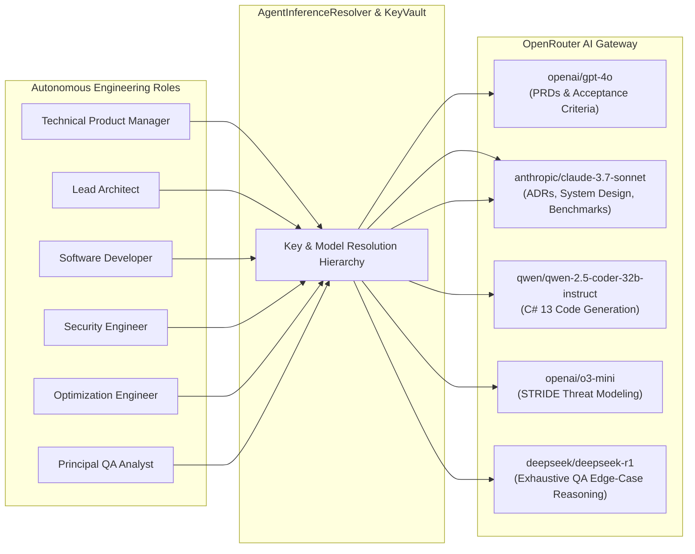

# Inference Hub, Key Vault & Security Architecture ⚡🛡️

## 1. Overview

Carnot Cycle Circus features a flexible **Inference Hub & API Key Vault** (`CarnotCycleCircus.Core.Domain.Inference`). It enables software teams to route different autonomous engineering roles to their optimal LLM models via **OpenRouter**, manage multiple API credentials safely with live mid-flight swapping, and seamlessly fallback to an offline deterministic simulation engine for testing and air-gapped development.

---

## 2. Multi-Model Inference Routing

Different engineering roles have vastly different reasoning, coding, and cost requirements. Carnot Cycle Circus avoids one-size-fits-all model routing:



### 2.1 Model Mapping Defaults

| Role | Default Model | Fallback Model | Default Temp | Justification |
| :--- | :--- | :--- | :--- | :--- |
| **TPM** | `openai/gpt-4o` | `anthropic/claude-3.5-haiku` | `0.2` | Broad business logic, PRD formatting, user story clarity. |
| **Lead Architect** | `anthropic/claude-3.7-sonnet` | `openai/gpt-4o` | `0.1` | Extended reasoning, clean architectural abstractions, MADR structure. |
| **Software Developer** | `qwen/qwen-2.5-coder-32b-instruct` | `anthropic/claude-3.7-sonnet` | `0.1` | Specialized coding syntax, C# 13 features, low latency. |
| **Security Engineer** | `openai/o3-mini` | `deepseek/deepseek-r1` | `0.0` | Deep deterministic reasoning for STRIDE threat models and vulnerability detection. |
| **Optimization Engineer** | `anthropic/claude-3.7-sonnet` | `openai/gpt-4o` | `0.0` | Algorithmic analysis, asymptotic complexity, ValueTask / Span memory auditing. |
| **Principal QA Analyst** | `deepseek/deepseek-r1` | `openai/o3-mini` | `0.1` | Adversarial reasoning, demonic edge cases, fuzzing matrices. |

---

## 3. Client-Side API Key Vault & Cryptographic Storage (`ApiKeyVaultService`)

To safeguard sensitive API credentials, the platform enforces hardware-accelerated **Envelope Encryption (ADR-0009)**:
1. **Authenticated Encryption at Rest (AES-256-GCM AEAD)**: Keys persisted to disk in `keys.vault.json` are encrypted using authenticated AES-256-GCM with 96-bit random nonces and 128-bit integrity tags.
2. **Context-Bound Associated Data (AAD)**: Ciphertext is cryptographically bound to key identifiers (`carnot:vault:v1:{KeyId}:{Provider}`) to prevent ciphertext transplantation or swapping.
3. **Multi-Tier Master Key Provider (`IMasterKeyProvider`)**:
   - `CARNOT_VAULT_MASTER_KEY` / `CARNOT_MASTER_KEY` environment variable.
   - Host-bound persistent key file (`.carnot.master.key` with POSIX `0600` permissions).
   - PBKDF2-HMAC-SHA256 derivation with 310,000 iterations and cryptographic salts.
4. **Memory Hygiene & Zeroization**: Cryptographic buffers and intermediate secret spans are wiped via `CryptographicOperations.ZeroMemory`.
5. **Key Masking**: UI representations display masked strings (`sk-or...4f9a`), and logs strip authentication headers.
6. **Master Key Rotation & Backup Export**:
   - Operators can rotate master encryption keys (`RotateMasterKeyAsync`), which re-encrypts all stored secrets under a new key.
   - Encrypted backup bundles can be exported and imported with password-based encryption (`ExportEncryptedVaultAsync` / `ImportEncryptedVaultAsync`).
7. **Transparent Migration**: Automatically detects and migrates legacy plaintext `keys.json` files to encrypted `keys.vault.json`, removing the cleartext file immediately.

### 3.1 Key Resolution Hierarchy (`AgentInferenceResolver`)

When an agent executes an inference task, credentials are resolved in priority order:

$$\text{Role Custom Key} \to \text{Team Global Key} \to \text{Active Vault Key} \to \text{Default Sandbox Key}$$

```csharp
public (string Model, string ApiKey) ResolveInferenceParameters(AgentMember member, EngineeringTeam team)
{
    var model = member.EffectiveModel;
    
    string? apiKey = null;
    if (!string.IsNullOrEmpty(member.CustomApiKeyId))
    {
        apiKey = _keyVault.GetKey(member.CustomApiKeyId)?.RawApiKey;
    }

    if (string.IsNullOrEmpty(apiKey) && !string.IsNullOrEmpty(team.ActiveGlobalApiKeyId))
    {
        apiKey = _keyVault.GetKey(team.ActiveGlobalApiKeyId)?.RawApiKey;
    }

    if (string.IsNullOrEmpty(apiKey))
    {
        apiKey = _keyVault.GetActiveKey()?.RawApiKey ?? "sk-or-v1-sandbox-mock-carnot-circus-0001";
    }

    return (model, apiKey);
}
```

---

## 4. Inference Orchestration & Execution Engine (`AgentExecutionEngine`)

The **`AgentExecutionEngine`** coordinates live OpenRouter inference, autonomous self-healing, upstream context continuity, and multi-file deliverable synthesis:

### 4.1 Upstream Inter-Agent Context Continuity (`GatherUpstreamDeliverables`)
To ensure downstream agents have complete visibility into upstream artifacts:
- **Parent Epic Traversal**: Retrieves PRD artifacts produced by the TPM.
- **Dependency Ticket Traversal**: Aggregates ADRs from the Lead Architect, C# source code & test suites from the Developer.
- **Prompt Injection**: Injects formatted `=== UPSTREAM INTER-AGENT DELIVERABLE CONTEXT ===` blocks into role prompts, allowing:
  - Lead Architect to align system design with the TPM's PRD.
  - Developer to implement the exact C# type contracts specified in the Architect's ADR.
  - Security Engineer to perform STRIDE audits against actual C# source code.
  - Optimization Engineer to benchmark actual service methods.
  - Principal QA Analyst to map 100% of acceptance criteria directly to unit test assertions.
- **Host Codebase Context**: Injects solution name, target namespace, project names, and detected architecture patterns from `ICodebaseHarvesterService`.

### 4.2 Multi-File Deliverable Parsing
When generating C# implementations, the Software Developer agent outputs modular files tagged via markdown code blocks:
- ````csharp:I<Domain>Pipeline.cs```` (Domain models and service interface contracts)
- ````csharp:<Domain>PipelineService.cs```` (Zero-allocation service implementations)
- ````csharp:<Domain>ServiceCollectionExtensions.cs```` (Dependency injection registration extensions)
- ````csharp:<Domain>PipelineTests.cs```` (xUnit unit test suites)

`ParseDeliverableArtifacts` extracts each block into individual, named `ArtifactItem` objects for discrete storage and downstream routing.

### 4.3 Autonomous C# Syntax Self-Healing Loop
When live inference generates C# source code, the engine executes an immediate syntax validation pass:
1. `CSharpSyntaxCheckTool` parses AST syntax, balanced tokens, and method declarations.
2. If syntax errors are found, the engine publishes an alert event to `IAgentEventStream` and constructs a targeted remediation prompt detailing the exact syntax defects.
3. The LLM produces a corrected multi-file bundle at low temperature (`temp=0.1`).
4. The healed bundle is validated and returned, preventing avoidable pipeline failure rejections.

### 4.4 Test Isolation & Mock Fixtures
For fast, zero-cost unit and integration test execution, tests utilize `MockOpenRouterClient` (implementing `IOpenRouterClient`), ensuring 100% test isolation without incurring API costs or requiring network access in CI/CD pipelines.

---

## 5. Security & Threat Modeling (STRIDE Baseline)

The platform adheres to strict security controls across all boundaries:

| STRIDE Category | Threat Vector | Mitigation Strategy | Verification In Code |
| :--- | :--- | :--- | :--- |
| **Spoofing** | Rogue agent impersonation | All `HandoffPacket` and `AgentMessage` records carry strongly-typed `AgentRole` identities and immutable IDs. | `HandoffPacket.cs` |
| **Tampering** | In-flight payload mutation / disk manipulation | Domain models are immutable C# `record` types; persisted key vaults use AES-256-GCM AEAD authentication tags. | `TicketItem.cs`, `AesGcmKeyEncryptor.cs` |
| **Repudiation** | Disputed handoff history | `IAgentEventStream` logs an append-only in-memory telemetry trail. | `AgentEventStream.cs` |
| **Information Disclosure** | API key leakage & disk exfiltration | Keys are encrypted at rest with AES-256-GCM; memory is sanitized via `CryptographicOperations.ZeroMemory`; UI displays masked credentials. | `ApiKeyVaultService.cs`, `MasterKeyProvider.cs` |
| **Denial of Service** | Infinite retry loops & runaway tokens | `FailurePolicy` enforces `MaxRetries` and trips circuit breakers on repeated rejection. | `WorkflowGraph.cs` |
| **Elevation of Privilege**| Unauthorized tool execution | Tools are sandboxed via `IToolDefinition` with strict per-role `AllowedToolNames` access control. | `AgentPersona.cs` |
