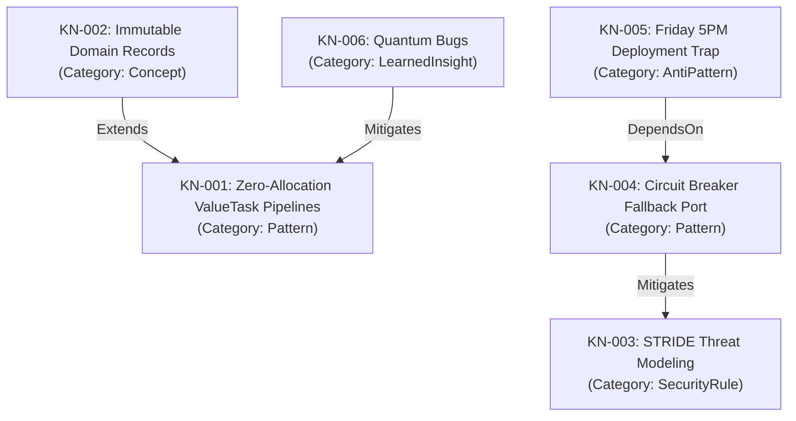
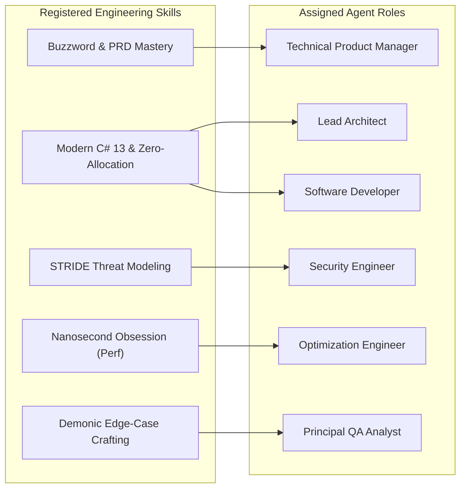

# AI Knowledge Maps & Dynamic Skill Registry 🗺️🛠️

## 1. Overview

Carnot Cycle Circus incorporates two tightly integrated knowledge and capability systems:
1. **AI Knowledge Maps** (`CarnotCycleCircus.Core.Domain.Knowledge`): A compact, context-efficient graph structure mapping domain concepts, architectural patterns, coding conventions, security rules, and learned insights.
2. **Dynamic Skill Registry** (`CarnotCycleCircus.Core.Domain.Skills`): A runtime capability system capable of importing, parsing, and assigning `SKILL.md` specifications to specific agent roles.

---

## 2. AI Knowledge Maps (`KnowledgeMapService`)

To prevent token waste while providing rich contextual guidance to agents and LLMs, the platform models engineering knowledge as a typed graph:



### 2.1 Node Categories

- **Concept**: Foundational architectural principles (e.g. Domain-Driven Design, Immutability).
- **Pattern**: Concrete software engineering patterns (e.g. Zero-Allocation ValueTask Pipelines, Circuit Breakers).
- **SecurityRule**: Governance and threat mitigations (e.g. STRIDE Threat Modeling, Input Allow-Lists).
- **AntiPattern**: Dangerous practices to avoid (e.g. Friday 5 PM Deploys, Mutable Shared State).
- **LearnedInsight**: Empirical operational heuristics discovered through agent execution.

### 2.2 Semantic Sub-Graph Extraction

Before invoking an agent on a ticket, `ExtractSubGraphContext(query)` performs keyword and tag filtering to retrieve relevant knowledge nodes, formatting them into compact LLM prompt context:

```
[AI Knowledge Map Context]
* Zero-Allocation ValueTask Pipelines (Pattern): Using ValueTask and ReadOnlyMemory<byte> on hot paths eliminates GC Gen0 pressure.
* Immutable Domain Records (Concept): Record types provide value-based equality, non-destructive mutation, and prevent state corruption.
```

---

## 3. Dynamic Skill Registry (`SkillRegistry`)

The Skill Registry manages the capabilities available to each agent role. Skills provide instructions, recommended tools, and behavioral guidelines.

### 3.1 Skill Definition Model

```csharp
public record SkillDefinition(
    string Id,
    string Name,
    string Description,
    string Instructions,
    IReadOnlyList<string> RecommendedTools,
    string Category = "General",
    IReadOnlyList<AgentRole>? AssignedRoles = null
);
```

### 3.2 Dynamic SKILL.md Importer (`SkillImporter`)

The `SkillImporter` supports three ingestion formats:
1. **Raw `SKILL.md` Markdown**: Parses YAML frontmatter (`name`, `description`, `category`) and extracts instructions.
2. **JSON Payloads**: Deserializes typed `SkillDefinition` objects.
3. **Remote Web URLs**: Fetches and parses skill definitions directly over HTTPS.

```markdown
---
name: Modern C# 13 & Zero-Allocation Dogma
description: Patterns for readonly record structs, pattern matching, Span/Memory, and async/await.
category: Architecture
---

# Instructions
Enforce zero-allocation Span/Memory where possible, use records for immutable domain modeling, and ban all setters.
```

---

## 4. Agent Skill Capability Matrix

The platform maps skills to roles dynamically using the `ISkillRegistry` interface:



In the Blazor UI (`/skill-matrix`), operators can view a live interactive grid of all registered skills and toggle capabilities on or off per agent role in real-time.
