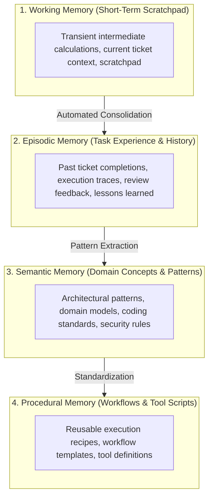

# Hierarchical Persistent Memory Layer (OpenViking-Style) 🧠💾

## 1. Overview

Carnot Cycle Circus implements a multi-tiered **Hierarchical Persistent Memory Architecture** (`CarnotCycleCircus.Core.Domain.Memory`) inspired by OpenViking and modern cognitive architectures. It solves agent context drift and amnesia by maintaining distinct memory tiers, local vector similarity search, automated task consolidation, and external vector database synchronization.

---

## 2. The 4-Tier Memory Model



### 2.1 Memory Types Definition

```csharp
public enum MemoryType
{
    Working,     // Short-term transient execution steps and scratchpad
    Episodic,    // Past task executions, lessons learned, and handoffs
    Semantic,    // Domain concepts, architectural patterns, and rules
    Procedural   // Reusable workflows, tool execution templates, and scripts
}

public record MemoryEntry(
    string Id,
    MemoryType Type,
    AgentRole Role,
    string Content,
    IReadOnlyList<float> Embedding,
    float Importance, // 0.0 (trivial) to 1.0 (critical)
    IReadOnlyDictionary<string, string> Tags,
    DateTimeOffset Timestamp,
    DateTimeOffset LastAccessedAt
)
{
    public MemoryEntry Touch() => this with { LastAccessedAt = DateTimeOffset.UtcNow };
}
```

---

## 3. Embedded Vector Memory Store (`EmbeddedVectorMemoryStore`)

The platform includes a built-in, zero-external-dependency vector search engine:

### 3.1 64-Dimensional Embedding Generation
- Incoming text is tokenized into word stems.
- Word hashes are generated using `SHA256` and projected across 64 dimensions.
- The resulting vector is normalized to unit length ($\|v\| = 1.0$):

$$\hat{v} = \frac{v}{\sqrt{\sum_{i=1}^{64} v_i^2}}$$

### 3.2 Composite Similarity Scoring
Search ranking combines cosine vector similarity, exact keyword token matching, and entry importance:

$$\text{FinalScore} = (0.6 \times \text{CosineSimilarity}) + (0.3 \times \text{TokenOverlapRatio}) + (0.1 \times \text{Importance})$$

```csharp
public Task<IReadOnlyList<MemorySearchResult>> SearchAsync(
    string query,
    int topK = 5,
    MemoryType? typeFilter = null,
    AgentRole? roleFilter = null,
    CancellationToken cancellationToken = default);
```

---

## 4. Automated Memory Consolidation (`MemoryConsolidationEngine`)

When an agent completes a ticket in the workflow DAG, the `MemoryConsolidationEngine` executes post-task consolidation:

1. Synthesizes a structured episodic memory summarizing the deliverables, acceptance criteria, and assignee role.
2. Generates vector embeddings for the summary.
3. Assigns an importance score of `0.85`.
4. Attaches indexing tags (`TicketId`, `TicketType`, `Role`).
5. Persists the entry in the `IPersistentMemoryStore`.

```csharp
public async Task<MemoryEntry> ConsolidateTaskCompletionAsync(
    TicketItem ticket,
    IReadOnlyList<AgentMessage> taskMessages,
    CancellationToken cancellationToken = default)
{
    var summary = $"Task [{ticket.Id}] '{ticket.Title}' completed by {ticket.AssigneeRole.ToDisplayName()}.\n" +
                  $"Key Deliverables: {ticket.Deliverables.Count} artifacts produced.\n" +
                  $"Acceptance Criteria: {string.Join("; ", ticket.AcceptanceCriteria)}";

    var episodicMemory = new MemoryEntry(
        Id: $"MEM-EP-{Guid.NewGuid().ToString("N")[..6]}",
        Type: MemoryType.Episodic,
        Role: ticket.AssigneeRole,
        Content: summary,
        Embedding: _memoryStore.GenerateEmbedding(summary),
        Importance: 0.85f,
        Tags: new Dictionary<string, string>
        {
            ["TicketId"] = ticket.Id,
            ["TicketType"] = ticket.Type.ToString(),
            ["Role"] = ticket.AssigneeRole.ToString()
        },
        Timestamp: DateTimeOffset.UtcNow,
        LastAccessedAt: DateTimeOffset.UtcNow
    );

    await _memoryStore.StoreAsync(episodicMemory, cancellationToken);
    return episodicMemory;
}
```

---

## 5. Context-Aware Memory Injection (`ContextAwareMemoryInjector`)

Prior to invoking an LLM inference call for a specific agent role, the `ContextAwareMemoryInjector` performs a semantic query against the memory store and injects relevant memories into the prompt context:

```
[Hierarchical Persistent Memory Context]
- [Semantic | Relevance: 94%]: Using ValueTask and ReadOnlyMemory<byte> on hot paths eliminates GC Gen0 pressure.
- [Episodic | Relevance: 88%]: Task [SUB-101] 'Core Ingestion Engine' completed with 0 heap allocations.
```

---

## 6. Memory Pruning & Lifecycle Management

To prevent context bloat and memory exhaustion:
- **`PruneAsync(minImportanceThreshold, olderThan)`**: Evaluates working and episodic memories. Any entry with importance below the threshold that has not been accessed within the `olderThan` window is automatically evicted.
- **Blazor Memory Inspector (`/memory`)**: Operators can inspect memory distribution across tiers, test vector search queries, and trigger manual or scheduled memory pruning.

---

## 7. External Memory Synchronization (`ExternalMemoryConnector`)

For enterprise deployments requiring shared multi-node vector memory, the `IExternalMemoryConnector` provides REST synchronization with external vector systems (e.g. OpenViking, Mem0, Qdrant):

- **`PingAsync(endpointUrl)`**: Verifies external memory cluster health.
- **`SyncExternalAsync(endpointUrl, entries)`**: Bulk exports local episodic and semantic memory entries to external storage.
