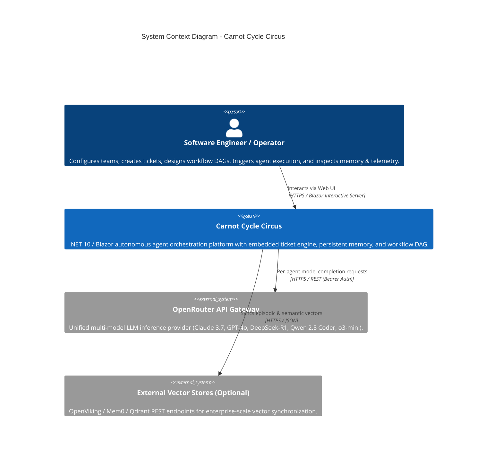
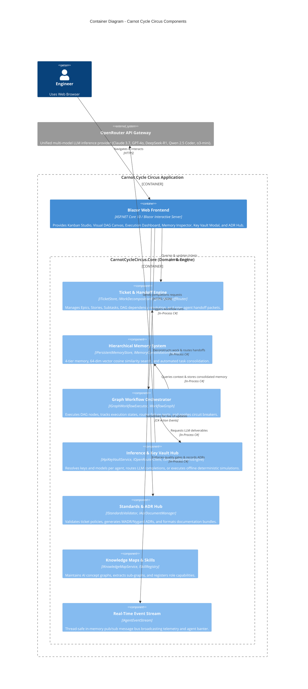
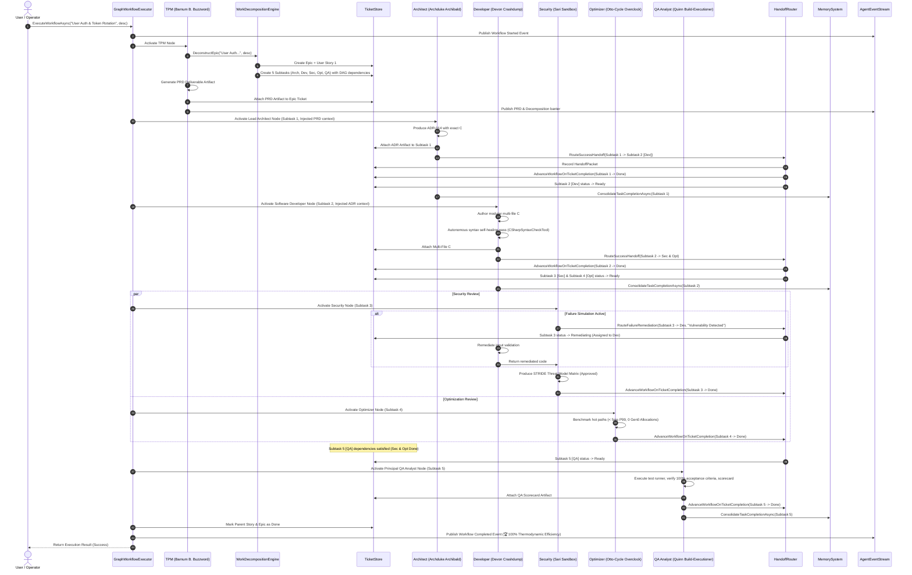

# System Architecture & Overview 🏛️

## 1. Executive Summary

**Carnot Cycle Circus** is an autonomous engineering agent orchestration platform designed to model, coordinate, and execute complete software engineering lifecycles. Built in **.NET 10 (C# 13)** with an interactive **ASP.NET Core Blazor** web interface, it organizes software engineering into six specialized autonomous roles working concurrently or in structured Directed Acyclic Graph (DAG) pipelines.

The platform resolves common multi-agent coordination problems through:
1. **Embedded Ticket Management**: Hierarchical work decomposition ($Epics \to Stories \to Subtasks$) with explicit dependency scheduling.
2. **Structured Handoff Contracts**: Formal `HandoffPacket` payloads passing deliverables, context, review checklists, and remediation instructions.
3. **Connectable Visual Workflow Canvas**: Multi-port nodes exposing Input, Success Output, and Failure/Reject ports for self-healing loops.
4. **Hierarchical Persistent Memory (OpenViking-Style)**: 4-tier memory architecture (Working, Episodic, Semantic, Procedural) with local 64-dimensional vector similarity search.
5. **Dynamic OpenRouter Inference & Key Vault**: Multi-model assignment with per-role API keys, mid-flight swapping, and offline simulation fallback.
6. **Governance & Standards Engine**: Configurable acceptance criteria, STRIDE threat audits, zero-allocation policies, and automated ADR generation.

---

## 2. C4 Architecture Models

### 2.1 C4 Level 1: System Context Diagram



### 2.2 C4 Level 2: Container Diagram



---

## 3. Layered Solution Structure

The repository follows a clean, decoupled architecture:

```
carnot-cycle-circus/
├── CarnotCycleCircus.slnx               # Modern XML-based solution manifest
├── Directory.Build.props               # Central compiler warnings, C# 13, TreatWarningsAsErrors
├── Directory.Packages.props            # Central Package Management (CPM)
│
├── src/
│   ├── CarnotCycleCircus.Core/         # Core Domain & Orchestration Library (.NET 10.0)
│   │   ├── Domain/
│   │   │   ├── Agents/                 # AgentRole, AgentPersona, EngineeringTeam
│   │   │   ├── Artifacts/              # ArtifactDescriptor, ArtifactManager, IArtifactManager
│   │   │   ├── Blueprints/             # ProjectBlueprintService
│   │   │   ├── Docs/                   # AdrDocumentManager, ArchitecturalDecisionRecord
│   │   │   ├── Events/                 # AgentEventStream, AgentMessage, ArtifactItem
│   │   │   ├── Graph/                  # WorkflowGraph, GraphWorkflowExecutor, Ports
│   │   │   ├── Harvester/              # CodebaseHarvesterService
│   │   │   ├── Inference/              # ApiKeyVaultService, OpenRouterClient, SimulatedScenarioEngine, ModelCatalogService
│   │   │   ├── Knowledge/              # KnowledgeMapService, KnowledgeNode, KnowledgeEdge
│   │   │   ├── Learning/               # SelfImprovementEngine, AutonomousSelfImprovementWorker
│   │   │   ├── Memory/                 # MemoryEntry, PersistentMemoryStore, MemoryServices
│   │   │   ├── Security/               # EncryptedPayload, MasterKeyProvider, AesGcmKeyEncryptor
│   │   │   ├── Showcase/               # ShowcaseDemoService
│   │   │   ├── Skills/                 # SkillRegistry, SkillImporter, SkillDefinition
│   │   │   ├── Standards/              # StandardsValidator, EngineeringStandardsProfile
│   │   │   ├── Storage/                # CarnotStorageOptions, FilePersistentStorageService
│   │   │   ├── Teams/                  # TeamDefinitionManager, TeamArchetypes
│   │   │   ├── Tickets/                # TicketItem, TicketStore, WorkDecompositionEngine, HandoffRouter
│   │   │   └── Tools/                  # IToolDefinition, WebSearch, CSharpSyntaxCheck, TestRunner
│   │   └── Extensions/
│   │       └── ServiceCollectionExtensions.cs # Centralized DI registration
│   │
│   └── CarnotCycleCircus.Web/          # Blazor Web Frontend (.NET 10.0)
│       ├── Components/
│       │   ├── Layout/                 # MainLayout, NavMenu
│       │   ├── Pages/                  # 13 Interactive Blazor Pages (ArtifactsHub, Canvas, Dashboard, etc.)
│       │   └── Modals/                 # KeyVaultModal, ProjectIgnitionModal, CodebaseHarvesterModal, ShowcaseModal, TicketModal
│       ├── Program.cs                  # Host configuration & pipeline setup
│       └── wwwroot/                    # Modern dark-theme stylesheets & UI assets
│
├── tests/
│   └── CarnotCycleCircus.Tests/        # Comprehensive Unit & Integration Tests (xUnit + FluentAssertions)
│       └── [17 Test Suites]           # Complete coverage across all domain services
│
├── skills/                             # Preserved engineering skills & .NET standards
└── docs/                               # Comprehensive Human & LLM Documentation Suite
```

---

## 4. End-to-End Execution Flow

When a user initiates an Epic execution (e.g. from the **Execution Dashboard** or **Workflow Canvas**), the system orchestrates the following sequence:



---

## 5. Dependency Injection Architecture

All core services are registered as singletons using `IServiceCollection` extension methods in `CarnotCycleCircus.Core.Extensions.ServiceCollectionExtensions`:

```csharp
public static IServiceCollection AddCarnotCycleCircusCore(this IServiceCollection services)
{
    // Event Stream & Message Bus
    services.AddSingleton<IAgentEventStream, AgentEventStream>();

    // Ticket Management & Work Decomposition Engine
    services.AddSingleton<ITicketStore, TicketStore>();
    services.AddSingleton<IWorkDecompositionEngine, WorkDecompositionEngine>();
    services.AddSingleton<IHandoffRouter, HandoffRouter>();

    // Memory Layer
    services.AddSingleton<IPersistentMemoryStore, EmbeddedVectorMemoryStore>();
    services.AddSingleton<IExternalMemoryConnector, ExternalMemoryConnector>();
    services.AddSingleton<IMemoryConsolidationEngine, MemoryConsolidationEngine>();
    services.AddSingleton<IContextAwareMemoryInjector, ContextAwareMemoryInjector>();

    // Inference & Key Vault
    services.AddSingleton<IApiKeyVaultService, ApiKeyVaultService>();
    services.AddSingleton<IOpenRouterClient, OpenRouterClient>();
    services.AddSingleton<IAgentInferenceResolver, AgentInferenceResolver>();
    services.AddSingleton<ISimulatedScenarioEngine, SimulatedScenarioEngine>();

    // Tools Sandbox
    services.AddSingleton<IToolDefinition, WebSearchTool>();
    services.AddSingleton<IToolDefinition, CSharpSyntaxCheckTool>();
    services.AddSingleton<IToolDefinition, TestRunnerTool>();
    services.AddSingleton<IToolDefinition, AdrWriterTool>();
    services.AddSingleton<IToolDefinition, MemoryLookupTool>();

    // ADR & Documentation Hub
    services.AddSingleton<IAdrDocumentManager, AdrDocumentManager>();

    // Deliverables & Artifacts Hub
    services.AddSingleton<IArtifactManager, ArtifactManager>();

    // Standards & Quality Gates
    services.AddSingleton<IStandardsValidator, StandardsValidator>();

    // AI Knowledge Maps
    services.AddSingleton<IKnowledgeMapService, KnowledgeMapService>();

    // Teams & Archetypes
    services.AddSingleton<ITeamDefinitionManager, TeamDefinitionManager>();

    // Skills & Importer
    services.AddSingleton<ISkillImporter, SkillImporter>();
    services.AddSingleton<ISkillRegistry, SkillRegistry>();

    // Graph Orchestrator & Workflow Executor
    services.AddSingleton<IGraphWorkflowExecutor, GraphWorkflowExecutor>();

    return services;
}
```
