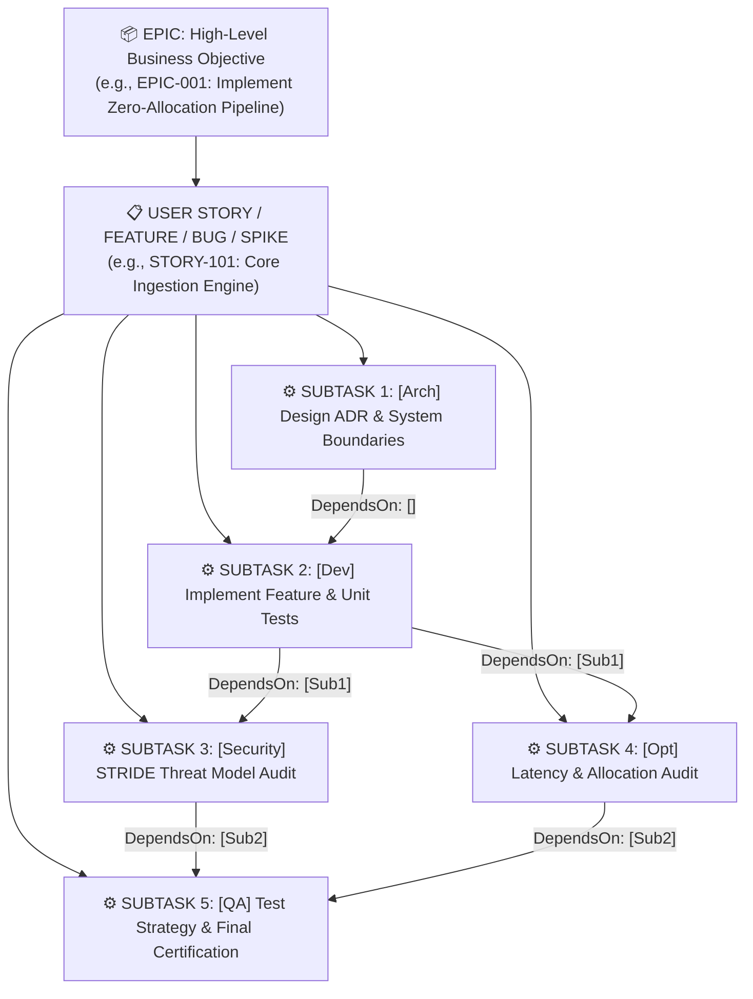
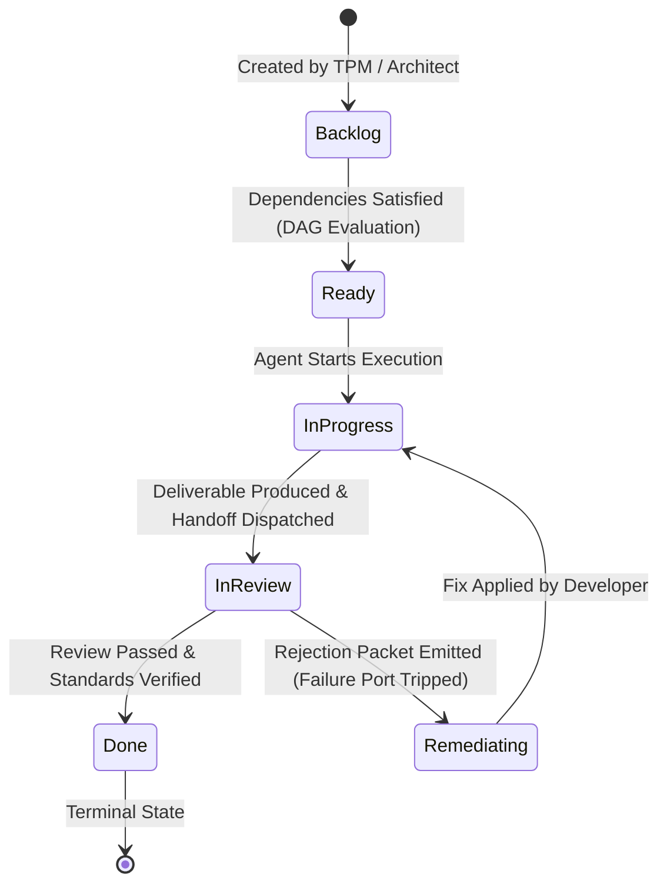

# Embedded Ticket Management & Work Decomposition Engine 🎫⚡

## 1. Overview

Carnot Cycle Circus incorporates an **Embedded Ticket Management & Work Decomposition Engine** (`CarnotCycleCircus.Core.Domain.Tickets`). Rather than treating agents as uncoordinated chat participants, the platform structures work using an enterprise agile backlog, DAG dependency scheduling, and formal inter-agent handoff contracts (`HandoffPacket`).

---

## 2. Hierarchical Ticket Structure

Work items are organized in a strict 3-tier hierarchy:



### 2.1 Ticket Types & Priorities

```csharp
public enum TicketType
{
    Epic,       // High-level initiative containing multiple stories/features
    Feature,    // End-to-end user-facing capability or system component
    Bug,        // Defect or regression requiring RCA and regression test
    Spike,      // Research or architectural exploration ticket
    Subtask     // Atomic technical work item assigned to a single agent role
}

public enum TicketPriority
{
    Low,
    Medium,
    High,
    Critical
}
```

---

## 3. Ticket Lifecycle & State Machine



```csharp
public enum TicketStatus
{
    Backlog,        // Pending dependency resolution or scheduling
    Ready,          // All prerequisite dependencies satisfied; eligible for execution
    InProgress,     // Currently being processed by assigned agent
    InReview,       // Deliverable produced; undergoing Security, Optimization, or QA audit
    Remediating,    // Rejected by reviewer; currently being remediated by fixing agent
    Blocked,        // Blocked by external impediment or circuit breaker
    Done            // Successfully verified and certified
}
```

---

## 4. Domain Models

### 4.1 TicketItem Model

```csharp
public record TicketItem(
    string Id,
    string? ParentEpicId,
    string Title,
    string Description,
    TicketType Type,
    TicketStatus Status,
    AgentRole AssigneeRole,
    AgentRole CreatedByRole,
    TicketPriority Priority,
    IReadOnlyList<string> DependsOnTicketIds,
    IReadOnlyList<string> AcceptanceCriteria,
    IReadOnlyList<ArtifactItem> Deliverables,
    IReadOnlyDictionary<string, string> Metadata,
    DateTimeOffset CreatedAt,
    DateTimeOffset? CompletedAt = null
)
{
    public bool IsTerminal => Status is TicketStatus.Done;
    public bool HasDependencies => DependsOnTicketIds.Count > 0;

    public TicketItem WithStatus(TicketStatus newStatus, DateTimeOffset? completedAt = null) =>
        this with
        {
            Status = newStatus,
            CompletedAt = newStatus == TicketStatus.Done ? (completedAt ?? DateTimeOffset.UtcNow) : (newStatus != TicketStatus.Done ? null : CompletedAt)
        };

    public TicketItem WithDeliverable(ArtifactItem deliverable) =>
        this with { Deliverables = Deliverables.Append(deliverable).ToList() };

    public TicketItem WithDeliverables(IEnumerable<ArtifactItem> deliverables) =>
        this with { Deliverables = Deliverables.Concat(deliverables).ToList() };

    public TicketItem WithAssignee(AgentRole role) =>
        this with { AssigneeRole = role };
}
```

### 4.2 HandoffPacket Model

The `HandoffPacket` represents the formal payload passed between agent roles upon milestone completion or rejection:

```csharp
public record HandoffPacket(
    string HandoffId,
    string TicketId,
    AgentRole FromAgentRole,
    AgentRole ToAgentRole,
    IReadOnlyList<ArtifactItem> Artifacts,
    string ContextSummary,
    string ActionRequested,
    IReadOnlyList<string> ReviewChecklist,
    string? RemediationNotes,
    DateTimeOffset Timestamp
);
```

---

## 5. Automated Work Decomposition (`WorkDecompositionEngine`)

The `WorkDecompositionEngine` automates the conversion of high-level objectives into granular technical DAGs across two explicit phases (ADR-0015):

1. **Stage 1 (Co-Discovery & Story Generation - PM & Research Analyst)**:
   - `DeconstructEpicIntoUserStories`: Converts the business goal into an `Epic` ticket (with attached Feasibility Brief and Product Requirements Document artifacts) and foundational `Feature` user stories with business acceptance criteria, assigned to the Lead Architect for technical refinement.
2. **Stage 2 (Architectural Backlog Refinement & ADR Design - Lead Architect)**:
   - `RefineStoryIntoTechnicalSubtasks`: The Lead Architect grooms each User Story into six atomic technical subtasks with exact contracts and DAG dependencies:
     - `Subtask 1 (Arch)`: ADR and Type Signatures (`[Arch] Design Architecture, C# Contracts & ADR`). Explicitly defines domain records, interface contracts, and DI extensions. Depends on: `[]`.
     - `Subtask 2 (Dev)`: Implementation and Test Suite (`[Dev] Implement Domain Models, Service & Tests`). Produces modular multi-file C# bundle matching Architect ADR. Depends on: `[Subtask 1]`.
     - `Subtask 3 (Security)`: STRIDE Threat Model Audit (`[Security] STRIDE Threat Model & Code Audit`). Evaluates delivered source code methods, buffers, and permissions. Depends on: `[Subtask 2]`.
     - `Subtask 4 (Optimization)`: Latency and Allocation Audit (`[Opt] Latency Bottleneck & Allocation Audit`). Benchmarks delivered service methods and audits 0B Gen0 GC allocations. Depends on: `[Subtask 2]`.
     - `Subtask 5 (QA)`: Test Strategy & Acceptance Certification (`[QA] Test Strategy & Final Acceptance Validation`). Maps 100% of acceptance criteria directly to unit tests and certifies release. Depends on: `[Subtask 3, Subtask 4]`.
     - `Subtask 6 (Integration)`: Solution Packaging & Repository Integration (`[Integration] Solution Packaging & Repository Integration`). Packages Clean Architecture project references and wires composition root. Depends on: `[Subtask 5]`.

---

## 6. DAG Dependency Scheduling & Handoff Routing (`HandoffRouter`)

The `HandoffRouter` evaluates DAG state transitions and records audit logs:

- **`RouteSuccessHandoff`**: Creates a success `HandoffPacket`, attaches artifacts, logs an event to `IAgentEventStream`, and advances downstream tickets.
- **`RouteFailureRemediation`**: Transitions the ticket to `TicketStatus.Remediating`, reassigns it to the fixing role (e.g. Developer), creates a remediation packet, and broadcasts an alert event.
- **`AdvanceWorkflowOnTicketCompletion`**:
  1. Marks the completed ticket as `TicketStatus.Done`.
  2. Queries all backlog tickets whose `DependsOnTicketIds` include the completed ticket.
  3. Validates whether all dependencies for each candidate ticket are now satisfied via `_ticketStore.AreDependenciesSatisfied(candidateId)`.
  4. If satisfied, transitions the candidate to `TicketStatus.Ready` and broadcasts an event to notify the assigned agent.
