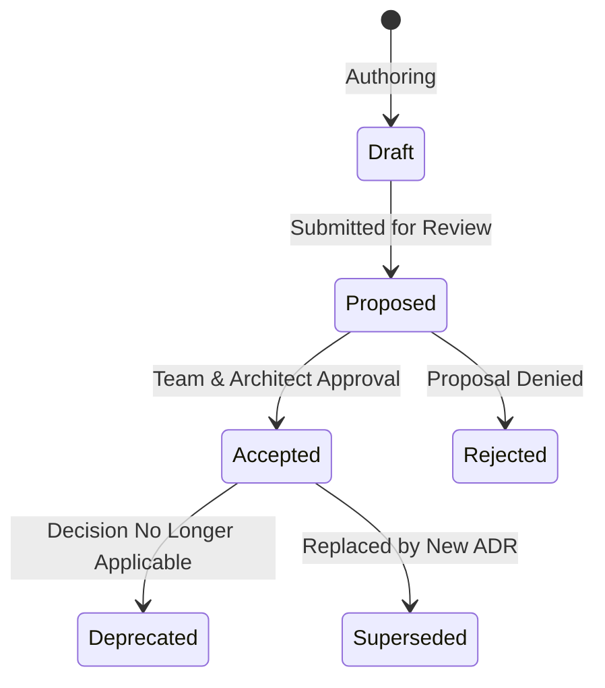

# Documentation & ADR Standards 📚✍️

## 1. Overview & Core Principles

Documentation in Carnot Cycle Circus is treated as a first-class engineering artifact governed by **Docs-as-Code** principles:
1. **Co-located with Code**: All documentation lives in `docs/` within version control.
2. **Deterministic & Executable**: Code snippets, schemas, and diagrams must be valid, compilable, and renderable.
3. **Dual Audience Optimization**: Documents must be formatted for both human readability and LLM context extraction.
4. **Zero Stale Documentation**: Major architectural changes must include an accompanying Architectural Decision Record (ADR).

---

## 2. Architectural Decision Record (ADR) Standards

We follow the **MADR (Markdown Architectural Decision Records)** format extended with Nygard-style positive/negative consequence breakdowns.

### 2.1 ADR Lifecycle States



- **`Draft`**: Currently being drafted by Lead Architect or engineering contributor.
- **`Proposed`**: Ready for team review and debate.
- **`Accepted`**: Approved and enforced across the codebase.
- **`Rejected`**: Decision not adopted; recorded for historical context.
- **`Deprecated`**: No longer relevant due to system evolution.
- **`Superseded`**: Replaced by a newer ADR (must link to replacement).

### 2.2 Standard ADR Structure

```markdown
# ADR-XXXX: Title of the Architectural Decision

## Status
**Accepted** (Updated: YYYY-MM-DD)

## Context
<!-- What is the problem, architectural challenge, or requirement driving this decision? -->

## Decision
<!-- What is the concrete architectural decision being adopted? -->

## Alternatives Considered
- <!-- Alternative 1 (Reason for rejection) -->
- <!-- Alternative 2 (Reason for rejection) -->

## Consequences
### Positive
- ✅ <!-- Positive outcome or benefit -->

### Negative / Trade-offs
- ⚠️ <!-- Downside, complexity, or cost -->
```

---

## 3. Diagramming Standards (Mermaid & C4)

- **Mermaid Diagrams**: All architectural, sequence, state, and flow diagrams must use Markdown fenced code blocks with language `mermaid`.
- **Labels with Special Characters**: Node labels containing parentheses, brackets, or punctuation must be enclosed in double quotes (e.g. `id["Label (Context)"]`).
- **C4 Architecture Diagrams**: Use Mermaid `C4Context` and `C4Container` schemas for system boundaries and components.

---

## 4. Documentation Bundle Export (`AdrDocumentManager`)

The platform includes an automated documentation compilation engine (`IAdrDocumentManager.ExportCompleteMarkdownBundle()`):
- Aggregates all registered ADRs.
- Embeds C4 architectural diagrams and STRIDE threat models.
- Generates a unified Markdown bundle suitable for offline compliance review, release audits, or LLM system prompt seeding.
