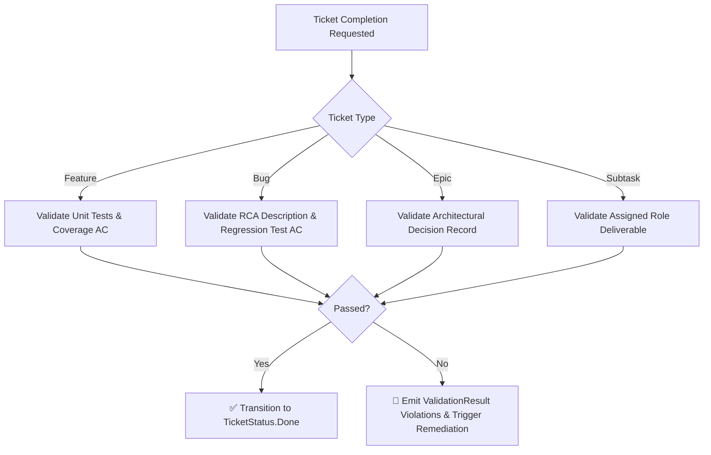

# Engineering Standards & Quality Gates 🚨🧪

## 1. Overview

The **Standards & Quality Gates Engine** (`CarnotCycleCircus.Core.Domain.Standards`) enforces automated engineering quality policies. Before any ticket can transition to `TicketStatus.Done`, it must satisfy the requirements of the active `EngineeringStandardsProfile`.

---

## 2. Engineering Standards Profiles

```csharp
public record EngineeringStandardsProfile(
    string Name,
    double MinimumCodeCoveragePercent = 80.0,
    bool RequireUnitTestsForFeatures = true,
    bool RequireRcaForBugs = true,
    bool RequireRegressionTestForBugs = true,
    bool RequireAdrForEpics = true,
    bool RequireStrideSecurityReview = true,
    bool RequireZeroAllocationAudit = true
)
{
    public static EngineeringStandardsProfile Default => 
        new("🚨 The Fun Police (Zero-Tolerance Quality Gates)");
}
```

---

## 3. Enforcement Rules by Ticket Type



### 3.1 Feature Tickets
- **Requirement**: Must include automated unit tests in acceptance criteria or deliverable artifacts.
- **Violation Message**: *"Feature ticket must specify and deliver automated unit tests (because 'It works on my machine' is not legally binding)."*

### 3.2 Bug Tickets
- **Requirement 1 (RCA)**: Must contain a formal Root Cause Analysis (RCA) in description or acceptance criteria.
  - **Violation Message**: *"Bug ticket requires explicit Root Cause Analysis (RCA) — a formal explanation of why entropy occurred."*
- **Requirement 2 (Regression Test)**: Must include an automated regression test preventing re-emergence.
  - **Violation Message**: *"Bug ticket requires an automated regression test so we don't look foolish when it recurs."*

### 3.3 Epic Tickets
- **Requirement**: Must link or produce an Architectural Decision Record (ADR).
- **Violation Message**: *"Epic requires an Architectural Decision Record (ADR) etched in the documentation temple."*

### 3.4 Architectural Compliance & QA Quality Gates
- **Requirement 1 (ADR Verification)**: QA audits upstream deliverables for an approved Architectural Decision Record (ADR) before certification.
- **Requirement 2 (Clean Architecture Scaffolding)**: Lead Architect must scaffold Domain entities, Application contracts, and DI extensions before implementation proceeds.
- **Violation Action**: QA trips failure port cable (`node-qa` $\xrightarrow{\text{Failure}}$ `node-arch`) and issues a remediation handoff directly to the **Lead Architect**.

---

## 4. Remediation Loopback Integration

When validation fails during DAG execution:
1. `IStandardsValidator.ValidateTicketForCompletion(ticket)` or `ValidateArchitecturalCompliance(...)` returns `ValidationResult.Failure(violations)`.
2. The `HandoffRouter` dispatches a failure remediation packet (`RouteFailureRemediation`).
3. For code or test defects, the ticket transitions to `TicketStatus.Remediating` assigned to **Software Developer**.
4. For missing ADRs or domain contract violations, the remediation packet routes to **Lead Architect** (`node-arch`).
5. The fixing agent resolves the violations and resubmits the deliverables through the DAG.

---

## 5. UI Management (`/standards`)

Operators can customize quality gate policies dynamically in the Blazor **Standards Manager** page (`Components/Pages/StandardsManager.razor`):
- Toggle individual policy rules on or off.
- Adjust minimum branch and line coverage thresholds.
- Switch between strict, balanced, and relaxed policy profiles.
